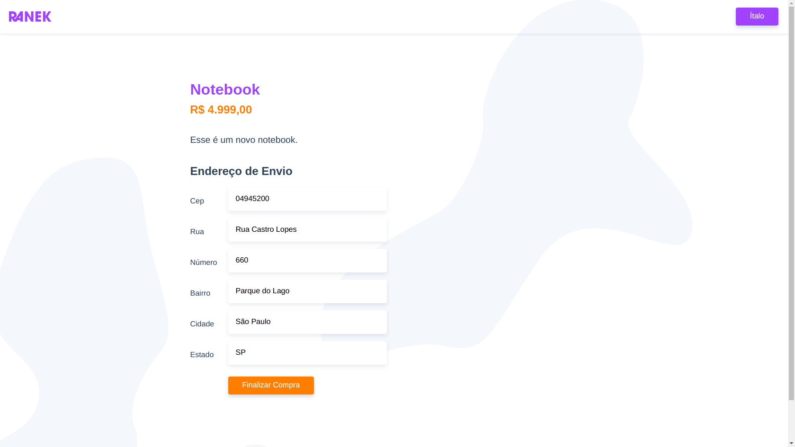
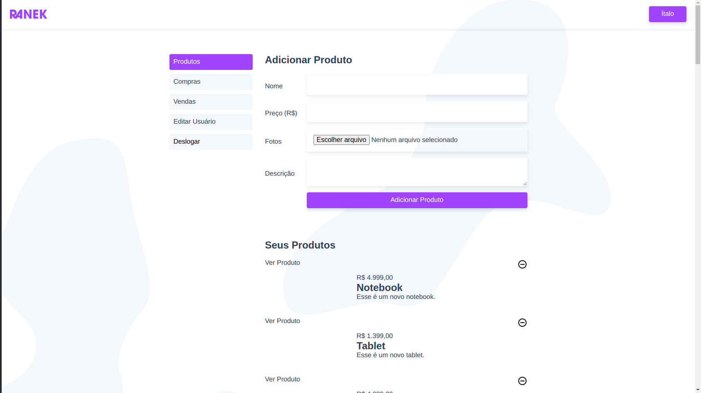

<div>
    <h1 align="center">
        
    </h1>
</div>

<div align="center">
    <h2> 🚀 Ranek - Origamid </h2>
</div>

<p align="center">
  <a href="#rocket-tecnologias">Tecnologias</a>&nbsp;&nbsp;&nbsp;|&nbsp;&nbsp;&nbsp;
  <a href="#-projeto">Projeto</a>&nbsp;&nbsp;&nbsp;|&nbsp;&nbsp;&nbsp;
  <a href="#wrench-instalação-e-uso">Instalação e uso</a>;
</p>

<div align="center">
  
</div>

## 👨🏼‍💻 Desenvolvedor

- [Ítalo Henrique](https://www.linkedin.com/in/italo-tech/)

## :rocket: Tecnologias

Esse projeto foi desenvolvido com a seguinte tecnologia:

- [HTML](https://devdocs.io/html/)
- [CSS](https://devdocs.io/css/)
- [Vuejs](https://vuex.vuejs.org/)

## 💻 Projeto

Ranek é um site de compras e vendas de produtos.

<div align="center">
  
  
  
</div>

## :wrench: Instalação e uso
1) Abra um terminal e copie este repositório com o comando
    ```
    git clone https://github.com/Italo-Tech/ranek-vuejs.git
    ```
   ou use a opção de download.

2) Entre na pasta com
    ```
    cd ranek-vuejs
    ```

3) Instale as dependências

    ```
    yarn install
    yarn add json-server
    ```

4) Rode a aplicação:
    ```
    yarn serve
    Abra um terminal e entre na pasta ranek-api e rode json-server ranek-api
    ```

5) Acesse ```http://localhost:8080``` no seu navagador para visualizar o projeto.
5) Acesse ```http://localhost:3000``` no seu navagador para rodar nosso backend fake.

### Customize configuration
See [Configuration Reference](https://cli.vuejs.org/config/).
